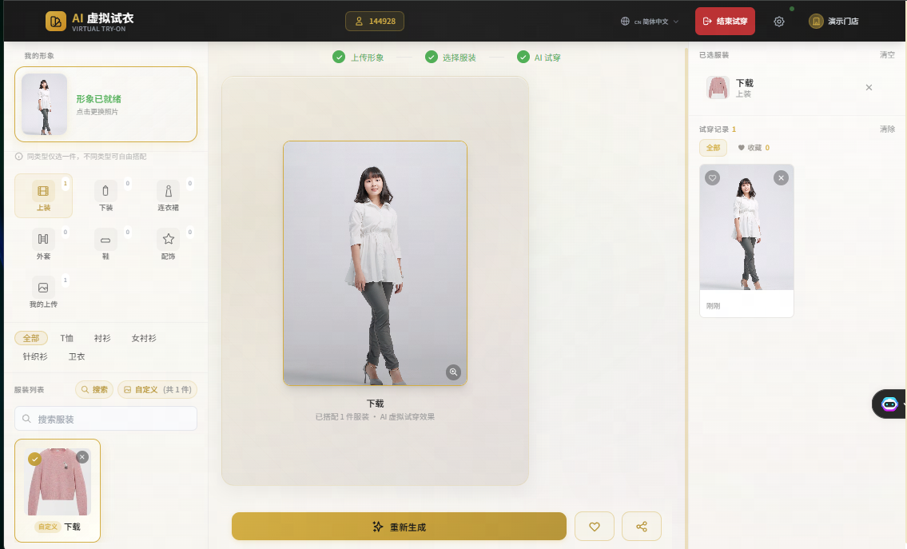

# AI 虚拟试衣系统 - 后端服务

基于 Django 5.x 的 AI 虚拟试衣系统后端 API 服务。

## 技术栈

- **框架**: Django 5.x + Django REST Framework
- **认证**: SimpleJWT (JWT Token)
- **数据库**: MySQL 8+
- **缓存/消息队列**: Redis + Celery
- **文件存储**: Django File Storage (本地/MinIO/OSS)

## 项目结构

```
my_project/
├── config/                 # Django 配置
│   ├── settings/           # 环境配置
│   ├── urls.py            # 根路由
│   └── celery.py          # Celery 配置
├── apps/
│   ├── accounts/          # 商家认证模块
│   ├── wardrobe/          # 衣橱管理模块
│   ├── tryon/             # 虚拟试穿模块
│   ├── media/             # 文件上传模块
│   └── common/            # 公共工具
├── media/                  # 媒体文件目录
├── scripts/               # 工具脚本
└── manage.py
```

## 快速开始

### 1. 安装依赖

```bash
pip install -r requirements.txt
```

### 2. 配置环境

```bash
cp .env.example .env
# 编辑 .env 文件配置数据库等信息
```

### 3. 创建数据库

```sql
CREATE DATABASE tryon_system CHARACTER SET utf8mb4 COLLATE utf8mb4_unicode_ci;
```

### 4. 运行迁移

```bash
python manage.py makemigrations
python manage.py migrate
```

### 5. 创建超级管理员

```bash
python manage.py createsuperuser
```

### 6. 启动服务

```bash
# 开发环境
python manage.py runserver

# 生产环境（需要先配置 Nginx）
python manage.py runserver 0.0.0.0:8000
```

### 7. 启动 Celery（可选，用于异步任务）

```bash
celery -A config worker -l info
```

## API 接口

### 认证模块 (`/api/v1/auth/`)

| 方法 | 路径 | 说明 |
|------|------|------|
| POST | `/login/` | 账号密码登录 |
| POST | `/sms-login/` | 短信验证码登录 |
| POST | `/send-sms/` | 发送验证码 |
| POST | `/refresh/` | 刷新 Token |
| POST | `/logout/` | 退出登录 |
| GET | `/me/` | 获取当前商家信息 |

### 衣橱模块 (`/api/v1/wardrobe/`)

| 方法 | 路径 | 说明 |
|------|------|------|
| GET | `/clothing/` | 获取服装列表 |
| POST | `/clothing/upload/` | 上传服装 |
| DELETE | `/clothing/<uuid>/` | 删除服装 |
| GET | `/categories/` | 获取分类配置 |

### 试穿模块 (`/api/v1/tryon/`)

| 方法 | 路径 | 说明 |
|------|------|------|
| POST | `/generate/` | 提交试穿任务 |
| GET | `/records/` | 获取试穿记录列表 |
| GET | `/records/<uuid>/status/` | 查询试穿状态 |
| POST | `/records/<uuid>/save/` | 收藏/取消收藏 |

### 文件模块 (`/api/v1/media/`)

| 方法 | 路径 | 说明 |
|------|------|------|
| POST | `/upload/` | 上传文件 |

## 管理后台

访问 `/admin/` 进入 Django 管理后台。

## 开发指南

### 代码规范

- 遵循 PEP 8
- 使用 Black 格式化代码
- 使用 isort 排序导入

### 测试

```bash
python manage.py test
```

## 部署

### 生产环境

1. 设置 `DJANGO_ENV=production`
2. 配置 Nginx 反向代理
3. 使用 Gunicorn/Uvicorn 运行
4. 配置 HTTPS

### Docker 部署

```bash
docker-compose up -d
```

## License

MIT
