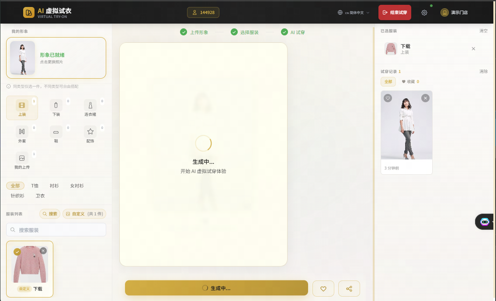

# AI 虚拟试衣系统

基于 Django 5.x + React 的 AI 虚拟试衣系统，支持商家上传服装图片，顾客进行虚拟试穿体验。

## 功能特性

- **商家认证**：支持账号密码登录、手机验证码登录
- **衣橱管理**：服装分类管理、批量上传、预设模板
- **虚拟试穿**：AI 智能换装、实时预览、历史记录
- **试穿配额**：配额管理、使用统计
- **多语言支持**：中文、英文、繁体中文
- **移动端适配**：响应式设计，完美支持移动设备

## 技术栈

### 后端
- **框架**：Django 5.x + Django REST Framework
- **认证**：SimpleJWT (JWT Token)
- **数据库**：MySQL 8+
- **缓存/消息队列**：Redis + Celery
- **文件存储**：本地 / MinIO / OSS

### 前端
- **框架**：React 18 + Vite
- **样式**：Tailwind CSS
- **状态管理**：React Hooks (useState, useCallback, useMemo)
- **HTTP 客户端**：Fetch API
- **国际化**：自定义 i18n Hook

## 项目结构

```
my_project/
├── config/                    # Django 配置
│   ├── settings/              # 环境配置 (dev/production)
│   ├── urls.py               # 根路由
│   └── celery.py             # Celery 配置
├── apps/
│   ├── accounts/             # 商家认证模块
│   ├── wardrobe/             # 衣橱管理模块
│   ├── tryon/                # 虚拟试穿模块
│   ├── media/                # 文件上传模块
│   └── common/               # 公共工具
│       ├── crypto.py         # 数据加解密工具
│       └── exceptions.py     # 自定义异常
├── frontend-react/           # React 前端
│   ├── src/
│   │   ├── components/       # UI 组件
│   │   ├── config/           # API 配置
│   │   ├── hooks/            # 自定义 Hooks
│   │   ├── utils/            # 工具函数
│   │   ├── data/             # 静态数据
│   │   └── App.jsx           # 主应用
│   ├── public/               # 静态资源
│   └── vite.config.js        # Vite 配置
├── media/                    # 媒体文件目录
├── scripts/                  # 工具脚本
└── manage.py
```

## 快速开始

### 1. 克隆项目

```bash
git clone <repository-url>
cd my_project
```

### 2. 后端配置

```bash
# 安装依赖
pip install -r requirements.txt

# 配置环境变量
cp .env.example .env
# 编辑 .env 文件配置数据库、Redis 等信息

# 创建数据库
mysql -u root -p
CREATE DATABASE tryon_system CHARACTER SET utf8mb4 COLLATE utf8mb4_unicode_ci;

# 运行迁移
python manage.py makemigrations
python manage.py migrate

# 创建超级管理员
python manage.py createsuperuser

# 启动后端服务
python manage.py runserver 8888
```

### 3. 前端配置

```bash
cd frontend-react

# 安装依赖
npm install

# 启动开发服务器
npm run dev
```

### 4. 启动 Celery（可选，用于异步试穿任务）

```bash
celery -A config worker -l info
```

### 5. 访问应用

- 前端地址：http://localhost:5173
- API 地址：http://localhost:8888/api/v1/
- 管理后台：http://localhost:8888/admin/

## API 接口

### 认证模块 (`/api/v1/auth/`)

| 方法 | 路径 | 说明 | 认证 |
|------|------|------|------|
| POST | `/login/` | 账号密码登录 | 否 |
| POST | `/sms-login/` | 短信验证码登录 | 否 |
| POST | `/send-sms/` | 发送验证码 | 否 |
| POST | `/refresh/` | 刷新 Token | 否 |
| POST | `/logout/` | 退出登录 | 是 |
| GET | `/me/` | 获取当前商家信息和配额 | 是 |

### 衣橱模块 (`/api/v1/wardrobe/`)

| 方法 | 路径 | 说明 | 认证 |
|------|------|------|------|
| GET | `/clothing/` | 获取服装列表 | 是 |
| POST | `/clothing/upload/` | 上传服装 | 是 |
| DELETE | `/clothing/<uuid>/` | 删除服装 | 是 |
| GET | `/categories/` | 获取分类配置 | 是 |
| GET | `/presets/` | 获取预设模板 | 是 |

### 试穿模块 (`/api/v1/tryon/`)

| 方法 | 路径 | 说明 | 认证 |
|------|------|------|------|
| POST | `/generate/` | 提交试穿任务 | 是 |
| GET | `/records/` | 获取试穿记录列表 | 是 |
| GET | `/records/<uuid>/status/` | 查询试穿状态 | 是 |
| POST | `/records/<uuid>/save/` | 收藏/取消收藏 | 是 |
| DELETE | `/records/<uuid>/` | 删除试穿记录 | 是 |
| POST | `/records/clear/` | 清空试穿记录 | 是 |

### 文件模块 (`/api/v1/media/`)

| 方法 | 路径 | 说明 | 认证 |
|------|------|------|------|
| POST | `/upload/` | 上传文件（形象照、服装图） | 是 |

## 环境变量

### 后端 (.env)

```env
# 环境
DJANGO_ENV=development

# 数据库
DB_NAME=tryon_system
DB_USER=root
DB_PASSWORD=your_password
DB_HOST=localhost
DB_PORT=3306

# Redis
REDIS_HOST=localhost
REDIS_PORT=6379

# JWT
JWT_SECRET_KEY=your_secret_key
JWT_ACCESS_TTL=3600
JWT_REFRESH_TTL=86400

# 数据加密开关
DATA_ENCRYPTION_ENABLED=false
```

### 前端 (.env)

```env
VITE_API_BASE_URL=/api/v1
```

## 数据加密

系统支持请求/响应数据加密（XOR + Base64），前后端通过配置开关控制：

- 后端：`DATA_ENCRYPTION_ENABLED=true`
- 前端：`request.js` 中 `setEncryptionEnabled(true)`

默认关闭，生产环境建议开启。

## 国际化

支持语言：
- 简体中文 (zh-CN) - 默认
- 繁体中文 (zh-TW)
- English (en)

通过右上角语言切换按钮切换。

## 开发指南

### 代码规范

- **后端**：PEP 8、Black、isort
- **前端**：ESLint、Prettier

### 测试

```bash
# 后端测试
python manage.py test

# 前端测试
cd frontend-react && npm test
```

## 部署

### 生产环境

```bash
# 后端
export DJANGO_ENV=production
gunicorn config.wsgi:application -b 0.0.0.0:8888

# 前端
cd frontend-react
npm run build
# 将 dist 目录部署到 Nginx
```

### Nginx 配置示例

```nginx
server {
    listen 80;
    server_name your-domain.com;

    # 前端静态文件
    location / {
        root /path/to/frontend-react/dist;
        try_files $uri $uri/ /index.html;
    }

    # API 代理
    location /api/ {
        proxy_pass http://127.0.0.1:8888;
        proxy_set_header Host $host;
        proxy_set_header X-Real-IP $remote_addr;
    }

    # 媒体文件
    location /media/ {
        alias /path/to/my_project/media/;
    }
}
```

### Docker 部署

```bash
docker-compose up -d
```

## 许可证

MIT


